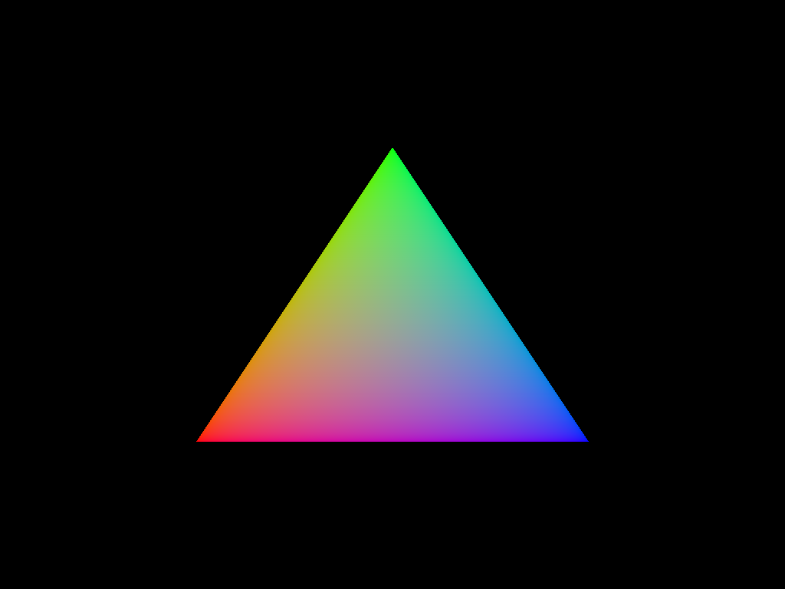

# Hello, Triangle!

In this section, you'll build a render pipeline and draw a triangle to the screen.

## Shaders

`wgpu` currently consumes SPIR-V as its shader representation.
In the future, `wgpu` will consume [WGSL], the WebGPU Shading Language, but it has yet to be stabilized.
In these examples, shaders are written in GLSL and compiled using [glslangValidator]; however, any method that produces well-formed SPIR-V will work with `wgpu`.

Create two basic shaders in `src/bin/hello/`, `shader.vert` and `shader.frag`:

```glsl
// shader.vert
#version 450

layout(location = 0) in vec2 in_position;
layout(location = 1) in vec3 in_color;

layout(location = 0) out vec3 out_color;

void main() {
    out_color = in_color;
    gl_Position = vec4(in_position, 0.0f, 1.0f);
}
```

```glsl
#version 450

layout(location = 0) in vec3 in_color;

layout(location = 0) out vec4 out_color;

void main() {
    out_color = vec4(in_color, 1.0f);
}
```

Compile these shaders to SPIR-V:

```
$ glslangValidator -V shader.vert -o shader.vert.spv
$ glslangValidator -V shader.frag -o shader.frag.spv
```

Once the SPIR-V is available, `wgpu` makes it very simple to include in your program, with the `include_spirv!` macro:

```rust,no_run,no_playground
async fn run(event_loop: EventLoop<()>, window: Window) {
    // let (device, queue) = ...
    
    let vert = device.create_shader_module(wgpu::include_spirv!("shader.vert.spv"));
    let frag = device.create_shader_module(wgpu::include_spirv!("shader.frag.spv"));
    
    // let size = ...
}
```

## Vertex buffer

The vertex shader above accepts vertices with two attributes: a two-component float vector position, and a three-component float vector color.
You can define a type `Vertex` as follows:

```rust,no_run,no_playground
#[repr(C)]
struct Vertex {
    position: [f32; 2],
    color: [f32; 3],
}
```

> ⚠️ &ensp; Any type crossing the CPU-GPU boundary *must* be `#[repr(C)]` to ensure that fields are laid out as they are declared.
> Keep in mind that different GPU resources have specific alignment requirements that must be made explicit in your Rust types.

Define an array of vertices to represent the triangle:

```rust,no_run,no_playground
const VERTICES: [Vertex; 3] = [
    Vertex {
        // bottom left
        position: [-0.5, -0.5],
        // red
        color: [1.0, 0.0, 0.0],
    },
    Vertex {
        // top
        position: [0.0, 0.5],
        // green
        color: [0.0, 1.0, 0.0],
    },
    Vertex {
        // bottom right
        position: [0.5, -0.5],
        // blue
        color: [0.0, 0.0, 1.0],
    },
];
```

When uploading data to the GPU, `wgpu` expects a `&[u8]`.
You can obtain this from a `&[T]` a couple ways:
- Call `as_ptr()` on the slice, cast to `*const T` and then `*const u8`, and then reconstruct a `&[u8]` from the pointer with `slice::from_raw_parts`. This can be tricky if you're not confident about the particulars of `unsafe` code.
- Use a library for performing this conversion, such as `bytemuck`. This is the approach taken by these examples, as it minimizes the amount of `unsafe` code being written.

Add `bytemuck` to your `Cargo.toml`:

```toml
[dependencies]
bytemuck = "1.3"
```

`bytemuck` provides a `Pod` ("plain old data") trait to mark types which can be safely cast to other `Pod` types, among other things.
Since there are no special semantics to your `Vertex` type, you can safely `impl Pod` for it:

```rust,no_run,no_playground
use bytemuck::{Pod, Zeroable};

// struct Vertex { ... }

unsafe impl Zeroable for Vertex {}
unsafe impl Pod for Vertex {}
```

`Pod` requires an `unsafe impl` because, when you `impl Pod` for a type, you agree to a contract stating that the type is safe to manipulate as raw bits and bytes without breaking something.
The [`Pod` trait docs] have a more complete explanation of the contract.

Now that `Vertex` can be easily cast to bytes, creating a vertex buffer is quite straightforward:

```rust,no_run,no_playground
use wgpu::util::DeviceExt;

async fn run(event_loop: EventLoop<()>, window: Window) {
    // let frag = ...
    
    // requires DeviceExt
    let vertex_buffer = device.create_buffer_init(&wgpu::util::BufferInitDescriptor {
        label: None,
        contents: bytemuck::cast_slice(&VERTICES),
        usage: wgpu::BufferUsage::COPY_DST | wgpu::BufferUsage::VERTEX,
    });

    // let size = ...
}
```

This code uses `Device::create_buffer_init`, a convenience method provided by `wgpu` to initialize a buffer with data at creation.
Since this method is not part of the WebGPU standard, it requires the `DeviceExt` trait to be imported.
The `contents` of the buffer are provided with `bytemuck::cast_slice`, which cleanly converts a `&[Vertex]` to a `&[u8]`.
The buffer requires the `COPY_DST` usage so that the provided data can be copied into it, and of course the `VERTEX` usage because it's a vertex buffer.

## Pipeline creation

In order to draw the elusive triangle, the GPU needs to know the desired inputs and outputs of the graphics pipeline.
In `wgpu`, this state is encoded in a `RenderPipeline` object, created like this:

```rust,no_run,no_playground
async fn run(event_loop: EventLoop<()>, window: Window) {
    // let swapchain_format = ...

    let pipeline_layout = device.create_pipeline_layout(&wgpu::PipelineLayoutDescriptor {
        label: None,
        bind_group_layouts: &[],
        push_constant_ranges: &[],
    });

    let render_pipeline = device.create_render_pipeline(&wgpu::RenderPipelineDescriptor {
        label: None,
        layout: Some(&pipeline_layout),
        vertex_stage: wgpu::ProgrammableStageDescriptor {
            module: &vert,
            entry_point: "main",
        },
        fragment_stage: Some(wgpu::ProgrammableStageDescriptor {
            module: &frag,
            entry_point: "main",
        }),
        rasterization_state: None,
        primitive_topology: wgpu::PrimitiveTopology::TriangleList,
        color_states: &[swapchain_format.into()],
        depth_stencil_state: None,
        vertex_state: wgpu::VertexStateDescriptor {
            index_format: wgpu::IndexFormat::Uint16,
            vertex_buffers: &[wgpu::VertexBufferDescriptor {
                stride: size_of::<Vertex>() as u64,
                step_mode: wgpu::InputStepMode::Vertex,
                attributes: &wgpu::vertex_attr_array![
                    // position
                    0 => Float2,
                    // color
                    1 => Float3,
                ],
            }],
        },
        sample_count: 1,
        sample_mask: !0,
        alpha_to_coverage_enabled: false,
    });
    
    // let size = ...
}
```

Don't panic! Breaking down the pipeline initialization:
- First, a `PipelineLayout` is created to describe the resources required by the pipeline. These resources can either be bindings, which are grouped in `BindGroup`s, or push constants.
  `BindGroup`s are analogous to descriptor sets in Vulkan, argument buffers in Metal, and descriptor heaps in D3D12.
  Since neither bind groups nor push constants are required here, the pipeline layout is in effect empty.
- `vertex_stage` and `fragment_stage` point to the vertex and fragment shader modules created earlier, with the entry point specified as `main`.
- Setting `rasterization_state` to `None` uses the default rasterization settings.
- `primitive_topology` is `TriangleList`, given that this example draws a single triangle.
- `color_states` specifies the behavior of the pipeline when writing to each color attachment.
  `wgpu` provides a `From<TextureFormat>` for `ColorStateDescriptor` which defines "default" behavior (i.e., no blending or masking).
- `depth_stencil_states` is `None` since there's no depth-stencil buffer.
- `vertex_state` describes the formats of the bound vertex buffers.
  Each vertex buffer has a corresponding `VertexBufferDescriptor` specifying the stride, step mode (`Vertex` or `Instance`), and attributes.
  The `vertex_attr_array!` macro is shorthand that maps attribute slots to attribute types; vertex attributes can also be specified manually with `VertexAttributeDescriptor`, although there's no real advantage to doing so.
- `sample_count` and `sample_mask` are used for MSAA, which is not enabled for this example.
- `alpha_to_coverage_enabled`, if `true`, causes the alpha channel to be interpreted as a coverage mask (see [Alpha to coverage] on Wikipedia).

Almost there! All that's left now is to set your shiny new pipeline and vertex buffer inside the render pass, and then make a draw call:

```rust,no_run,no_playground
async fn run(event_loop: EventLoop<()>, window: Window) {
    // let mut size_changed = ...

    event_loop.run(move |event, _, control_flow| match event {
        // Event::WindowEvent { .. } => ...

        Event::MainEventsCleared => {
            // let mut encoder = ...
            
            {
                // let mut pass = ...
                
                pass.set_pipeline(&render_pipeline);
                pass.set_vertex_buffer(0, vertex_buffer.slice(..));
                pass.draw(0..3, 0..1);
            }
        }
    });
}
```

`Buffer`s have a handy `slice()` method that works similarly to Rust's slice notation; here, the entire buffer is specified with `vertex_buffer.slice(..)`.
Finally, `RenderPass::draw` is called, drawing 3 vertices (the entire buffer) and one instance.

Et voilà:



Congratulations! You've just drawn your first polygon with `wgpu`.

[glslangValidator]: https://vulkan.lunarg.com/sdk/home
[WGSL]: https://gpuweb.github.io/gpuweb/wgsl.html
[`Pod` trait docs]: https://docs.rs/bytemuck/1.3.1/bytemuck/trait.Pod.html#safety
[Alpha to coverage]: https://en.wikipedia.org/wiki/Alpha_to_coverage
