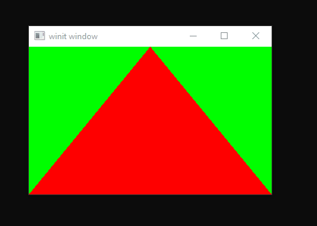

# Known Driver Issues

This page lists known issues with drivers that are not, or cannot, be worked
around by wgpu.

Issues are categorised by GPU vendor and backend. Where details such
as "driver version" are recorded, they are not intended to be exhaustive:
these are just the values where the issue has been observed. Just because
your combination is not explicitly listed does not mean you aren't
susceptible to the same issue.

## Intel / Vulkan

- **Integrated GPU not visible to programs named `cube`**

  | Property         | Values observed  |
  | ---------------- | ---------------- |
  | Operating System | Windows          |
  | Driver OEM       | Intel, Microsoft |
  | Driver Version   | 27.20.100.8935   |

  In a dual-GPU system, the driver for the Intel GPU will hide itself
  from programs named `cube`.

  The issue can be worked around by disabling the discrete GPU or by
  renaming the program to something other than `cube`.

## Intel / DirectX 12

- **Offset after resizing window**

  

  https://github.com/gfx-rs/wgpu-rs/issues/647

  | Property         | Values observed |
  | ---------------- | --------------- |
  | Operating System | Windows         |
  | Driver OEM       | Microsoft       |
  | Driver Version   | 26.20.100.7639  |

  This issue affects programs running on any GPU if the Intel GPU is being
  used by the compositor. This would typically be the case in dual-GPU
  systems.

  It can be worked around by replacing the Microsoft OEM driver with the
  generic Intel driver.

## Intel / All

- **Cannot combine MSAA with Srgb resolve**

  https://github.com/gfx-rs/wgpu/issues/725

  | Property         | Values observed |
  | ---------------- | --------------- |
  | Operating System | Linux           |

  Attempting to do MSAA resolve at the same time as Srgb resolve will cause
  MSAA to not work and the clear color to not be properly converted into
  Srgb.
